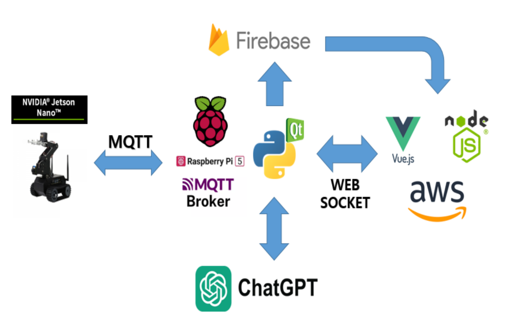
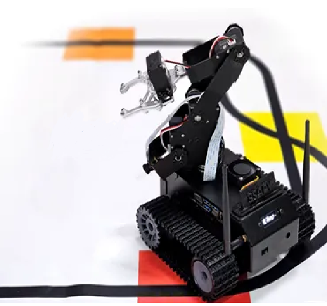
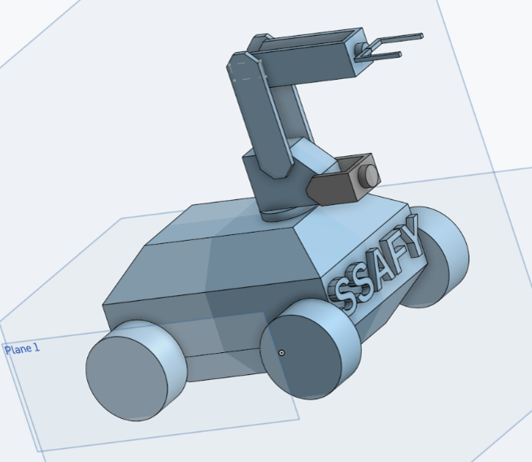

# JetNavTwin_PJT
-------------
0. C++를 통한 메모리와 성능 향상
1. 자율 주행을 통한 미션장소 이동
2. 조이스틱을 이용한 수동조작
3. MQTT를 이용한 통신과 외부 조종
4. 모델링과 동기화를 통한 디지털 트윈
5. OpenAI chatgpt를 통한 로그 분석
-------------
## System Diagram

 

## Hardware 
 
- Jetson Nano (4GB)
- Support three 18650 batteries, up to 12.6V voltage output, and stronger motor power.
- Onboard S-8254AA + AO4407A lithium battery protection circuit, with anti-overcharge, anti-over-discharge, anti-over-current and short-circuit protection functions.
- The onboard APW7313 voltage regulator chip can provide a stable 5V voltage to the Jetson Nano.
- The onboard SY8286 voltage regulator chip can provide a maximum current of 5A to the steering gear.
- The onboard TB6612FNG dual H-bridge motor driver chip can drive the left and right motors to work.
- Onboard 0.91-inch 128×32 resolution OLED, real-time display of car IP address, memory, power, etc.
- The onboard INA219 acquisition chip is convenient for real-time monitoring of battery voltage and charging current.

- <a href="https://www.waveshare.com/wiki/JETANK_AI_Kit" target="_blank">More Detail</a>

### onShape Model for Digital Twin

 

--------

### Demo

<a href="https://youtu.be/hk8sQVWbFak" target="_blank">https://youtu.be/hk8sQVWbFak</a>

