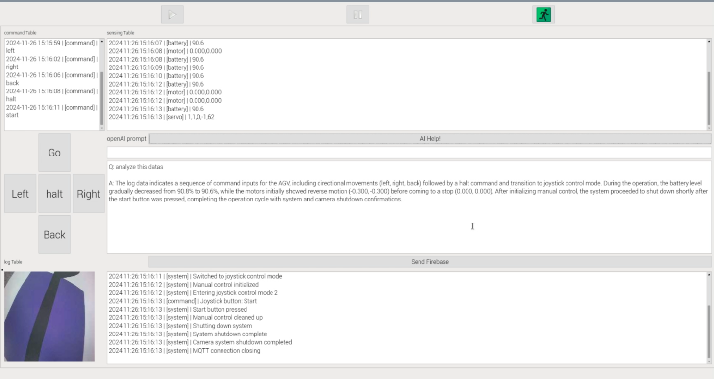

# MQTT-OpenAI GUI Program

## Overview
This is a PyQt GUI program that communicates with AGV through MQTT protocol, accumulates log data, and transmits it to OpenAI Playground's Assistant.


## Raspberry pi5 install
```bash
sudo apt install pyside2-tools -y
sudo apt install python3-pyside2.* -y
pip install firebase --break-system-packages
pip install pytz --break-system-packages
pip install openai --break-system-packages
```

## How to Run
Simply execute:
```bash
python mainwindow.py
```

## Configuration Requirements

### 1. Environment Variables (.env)
Create a `.env` file with your OpenAI API key and Assistant ID.
Refer to `.env.example` for the required format.

### 2. Firebase Configuration
- Required file: `firebase-service-account.json`
- This JSON file is obtained after creating a Firebase project
- Place this file in the project root directory

### 3. API Configuration
- FirebaseManager.py API modify
- OpenAIManager.py API modify
- AWSManager.py API modify

## Features
- MQTT communication with AGV
- Log data collection
- Integration with OpenAI Assistant
- Firebase connectivity
- User-friendly GUI interface

## Demo Image

